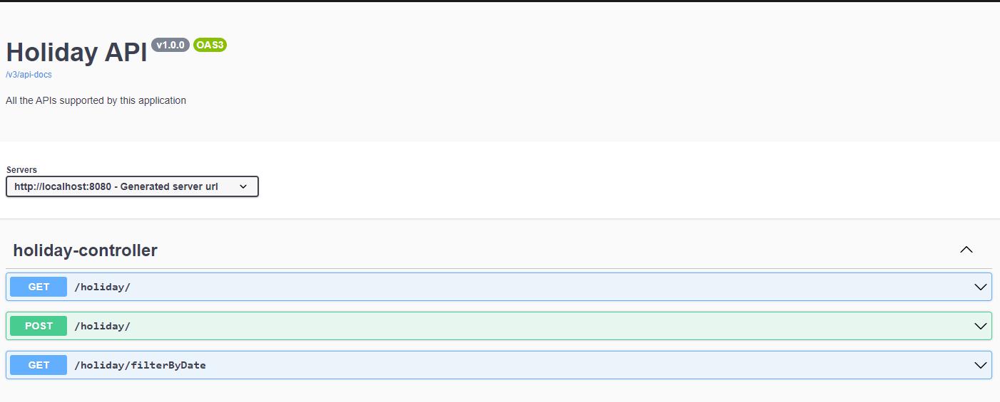
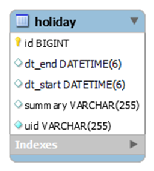
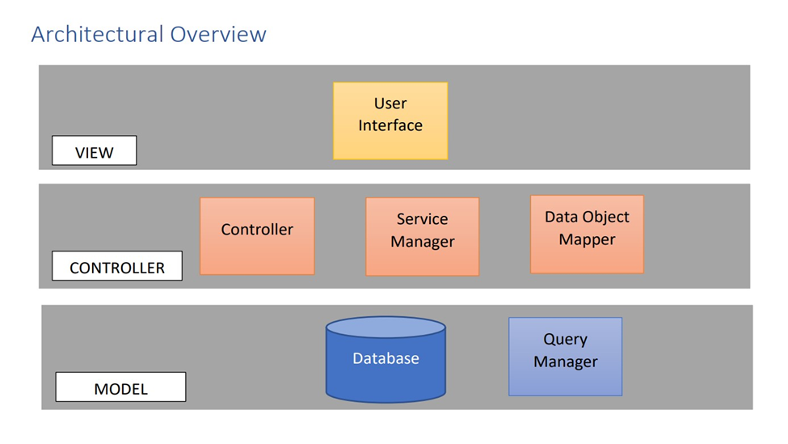
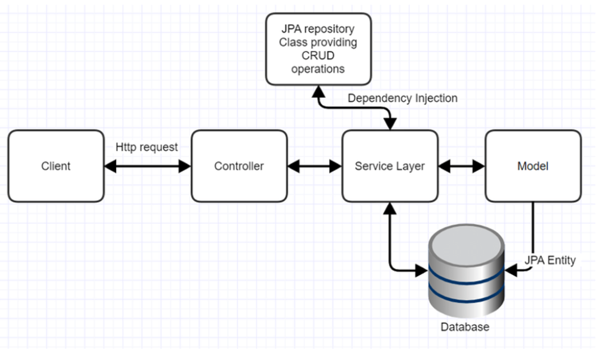
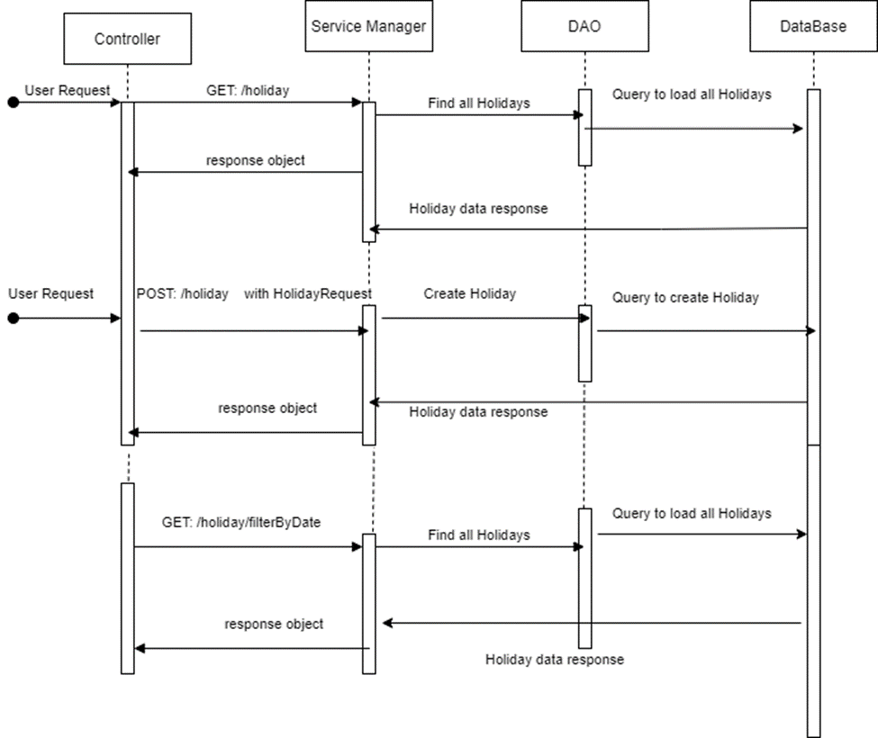

# Hong Kong Public Holidays Data

## About
Hong Kong Public Holidays Data from https://data.gov.hk/en-data/dataset/hk-effostatisticcal

Public API: https://api.data.gov.hk/v1/historical-archive/get-file?url=http%3A%2F%2Fwww.1823.gov.hk%2Fcommon%2Fical%2Fen.json&time=20220701-0912


## Contents
- [API Documentation](#api-documentation)
- [MySQL Database](#mysql-database)
- [Architectural Overview](#architectural-overview)
- [Sequence Diagram](#sequence-diagram)
- [Requirements](#requirements)
- [How to Use](#how-to-use)
- [Diary/Summary](#diarysummary)
- [Implementation Explanation](#implementation-explanation)

## API Documentation
Swagger is a set of open source tools for writing REST-based APIs. 
URL: http://localhost:8080/swagger-ui.html



## MySQL Database




Connection to database -
I used JDBC to connect the front end to the database.

```
spring.datasource.url=jdbc:mysql://localhost:3306/holiday
spring.datasource.username=root
spring.datasource.password=root
spring.jpa.hibernate.ddl-auto=update
spring.jpa.properties.hibernate.show_sql=true
server.error.include-message=always
```

## Architectural Overview



## Sequence Diagram
In the below diagram, when a request is received from the client, based on REST API, 
corresponding controller acts upon the request. The controller receives the request 
payload and converts it to a POJO(Plain Old Java Object) with the help of JAXB and 
sends it to the service layer to handle any business logic. Here we make the connection
to our database with the help of hibernate JDBC and executes the required command 
based on the type of request. Finally, JPA Hibernate runs the SQL command on the 
database and responds back with the result.



## Requirements
1. IDE - IntelliJ, Eclipse, Spring Tool Suite, or other
2. Web Browser - Google Chrome - 60 or later, Firefox 50 or later
3. Database - MySQL
4. Spring Boot with Maven for dependency injection

## How To Use

1. Import the project into your local system and import holiday folder inside the main into any IDE as an existing Maven project
2. Update application.properties file with your SQL user credentials. Create a schema named `holiday` in your local system
```
spring.datasource.url=jdbc:mysql://localhost:3306/holiday
spring.datasource.username=root
spring.datasource.password=root
spring.jpa.hibernate.ddl-auto=update
spring.jpa.properties.hibernate.show_sql=true
server.error.include-message=always
```
3. First, ensure you are in the holiday directory. Run project as a Spring Boot Application using the following command, depending on your OS:
- Mac `./mvnw clean spring-boot:run`

- Windows (Powershell) `.\mvnw clean spring-boot:run`

- Windows (Command Prompt) `mvnw clean spring-boot:run` 
4. Go to `http://localhost:8080/` in your browser to test the application
5. There are a total of 4 tests. HolidayControllerTest requires the app to be running

## Diary/Summary

Day 1: Setup, configuring the MySQL database and creating the spring boot app. Created router to load all holidays and filter holiday by dates.
Created basic index.html, style.css, script.js. Created the landing page using Bootstrap.
The `createTableRow` method in the JS file creates the table rows. It receives all the holidays and
for each of the holidays, an ER entity structure is created. This will create all the entries for the table.

Day 2: Created Get Data button, added event listener for onclick which gets holiday data from the public API and makes fetch call to local server to save in db.

Since the API included a lot of data which is not for our use case, I 
had to filter out everything except for the holiday events data. The data structure of the API is also different
to what we want in our database, so that is the purpose of `HolidayRequest.java`. Save was failing at server side due to mismatch in structure of API response to Domain object.
Fix: Created separate POJO called HolidayRequest which map to API response and wrote converter method that map this request to Holiday domain object. I utilised Hibernate to map `Holiday.java` with the
database. For example, `id` is mapped to the primary key. When the user presses the Get Data button,
the UI will send all the data from the API to the backend. In the `saveAllHolidays` method in `HolidayService.java`, the request data that is received 
needs to be converted back to the table structure. So in the `convertHolidayRequestToDomainObject` method, we are formatting the date since the API format is 
different, so we have to convert it into the form the database takes. Once this saving is done, it sends back the response to the UI.
At first, the public API call was failing because the response type wasn't set. I fixed this by rendering the response as JSON using res.json()

Created Search button, added event listener for onclick which filters holiday data with date filter condition using select query.

Day 3: Added Unit Tests. Implemented pagination so that each page can contain up to 10 records. Edited index.html to include navigation via unordered list. Inside the
unordered list there are no list elements as these are getting populated via the JS code.

### How the pagination works
All the holidays are being saved in a list. Table rows are then created, the data is being sliced so
instead of passing the entire array, I sliced the array into 10 elements. `currentPage` is initialised to 1 initially.
When the data is sliced, the array index starts at 0 which is why I do `currentPage` - 1. That's for the start and at the end
I do `currentPage` + numberOfHoliday -1 because if, for example it's 1 + 10 - this is 11. So that's why I take the 1 to make it 10.
If, for example there are less than 10 records there is no reason to show the pagination.
Depending on the current page, you can use the arrows to switch between records.

## Implementation Explanation

- ```HolidayApplication.java``` This will initiate the Tomcat server and make it run on the port 8080. Swagger API (using Open API) documentation is added to provide more info about the routers.


- ```HolidayController.java``` There are three routers for this application.
1. GET https://localhost:8080/holiday/

To load all the holiday data present in the Holiday table. This router produces the 
data in JSON format. When the UI makes fetch or AJAX request to current API, the 
corresponding endpoint gets triggered. It sends the request to service layer 
HolidayService for handling business logic. From service layer, it directly hits
HolidayRepository which is a JPA implementation file to load all the holiday data.

2. POST https://localhost:8080/holiday/

When the user clicks on Get Data button on UI, it first makes an API call to public 
API provided https://data.gov.hk/en-data/dataset/hk-effo-statistic-cal and response
data is sent as payload data to the server for persisting in MySQL database. Once 
the server requires the HolidayRequest payload, it sends it to the service layer to
convert request data to domain Object for storing in database.
In the service layer, saveAllHolidays receives the request and sends it to 
convertHolidayRequestToDomainObject to make it as persistable domain object, then 
it makes a call to database via HolidayRepository to store all the holidays data in 
Holiday Table.

3. GET https://localhost:8080/holiday/filterbyDate?startDate=2022-12-01&endDate=2022-12-1

This loads all the holiday data present in the Holiday table within the date range. 
This router produces the data in JSON format. When the UI makes a fetch or AJAX 
request to current API, then corresponding endpoint gets triggered. It sends the 
request to service layer HolidayService for handling business logic. 
From service layer, first it parses date from string format to date format then it
directly hits HolidayRepository which is a JPA implementation file to load all the
holiday data. 

- ```HolidayRepository.java```

This runs a SELECT query over all the records in Holiday table and filters according to the date range and sends it back as the response

- ```HolidayServiceTest.java```

Creates the request data and calls the functional method. The functional method 
should return the data back in the correct form. If the requested data matches
the expected output, the test will pass.

- ```HolidayControllerTest.java```

A couple of integration tests. Created a uri, then making a HTTP request to the uri.
It should send back a response and this should check if the data has been loaded
properly.